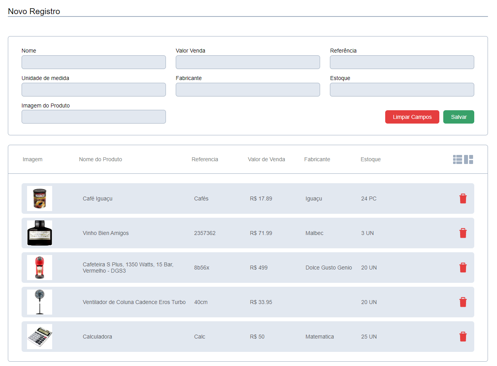

# Windel Web

> TESTE PROGRAMAÇÃO

[Clique aqui para acessar](https://ericktafarel.github.io/Windel/)

## Como foi realizar o projeto?

Neste projeto consegui verificar o que realmente sabia sobre programação em um teste de verdade. Percebi que ainda tenho que aprender e consolidar varios conhecimentos basicos e devo aprender um pouco mais de tecnologias como JavaScript que realmente é aonde o site começa a funcionar. Fiquei muito contente com o resultado mas poderia ter feito ele com mais funcionalidades se não tivesse me atrapalhado tanto quando fiz a API e poderia ter feito o codigo mais limpo e organizado.

## O que aprendi de novo?

- Aprendi como funciona a conexão com uma API.
- Aprendi a utilizar JavaScript de uma forma funcional, antes nunca havia pego os dados do input e colocado na tela utilizando esta linguagem.
- Aprendi a pensar melhor sobre o que vai ser utilizado no codigo antes de começar a programar para não ter que fazer o trabalho duas vezes. 

## Tecnologias

- HMTL
- CSS
- JAVASCRIPT
- API

## Contato

ericktafarel@gmail.com